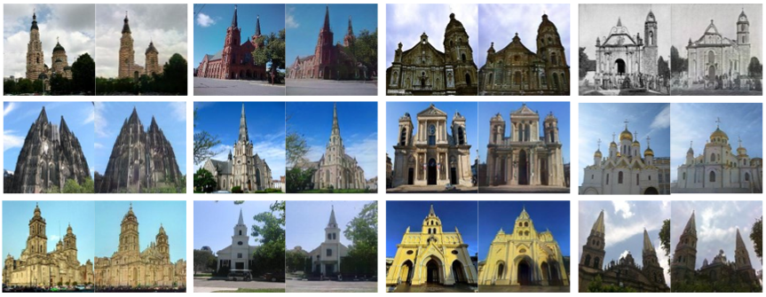

# More comprehensive facial inversion for more effective expression recognition  


> Facial expression recognition (FER) plays a significant role in the ubiquitous application of computer vision. We revisit this problem with a new perspective on whether it can acquire useful representations that improve FER performance in the image generation process, and propose a novel generative method based on the image inversion mechanism for the FER task, termed Inversion FER (IFER). Particularly, we devise a novel Adversarial Style Inversion Transformer (ASIT) towards IFER to comprehensively extract features of generated facial images. In addition, ASIT is equipped with an image inversion discriminator that measures the cosine similarity of semantic features between source and generated images, constrained by a distribution alignment loss. Finally, we introduce a feature modulation module to fuse the structural code and latent codes from ASIT for the subsequent FER work. We extensively evaluate ASIT on facial datasets such as FFHQ and CelebA-HQ, showing that our approach achieves state-of-the-art facial inversion performance. IFER also achieves competitive results in facial expression recognition datasets such as RAFDB, SFEW and AffectNet. 

The architecture of ASIT is demonstrated in the following:


More results:




## Updates  
**`2022.11.16`**:ASIT model, training and validation scripts released for FFHQ and Celeba-HQ image inversion. IFER model, training and validation scripts released for RAF-DB, SFEW and AffecNet image classification.    

### Pretrained Models  
Please download the pre-trained models from the following links. Each ASIT model contains the entire ASIT architecture, including the encoder and decoder weights.
| Path | Description  
| :--- | :----------  
|[FFHQ Inversion(code:asit)](https://pan.baidu.com/s/1IOd5c8bqkHjw2Gu8LJfATA)  | ASIT trained with the FFHQ dataset for facial inversion. 
|[Celeba-HQ Inversion(code:asit)](https://pan.baidu.com/s/1-Bo7Q3U1xRuxRtlGtnltiw)  |ASIT trained with the Celeba-HQ dataset for facial inversion.
|[RAF-DB checkpoint(code:ifer)](https://pan.baidu.com/s/15MkfeD9e_hoS90K_VzEd6g)  |IFER checkpoint trained with the RAF-DB for facial expression classification.
  
If you wish to use one of the pretrained models for training or inference, you may do so using the flag `--checkpoint_path`.  
  
 In addition, we provide various auxiliary models needed for training your own ASIT model from scratch as well as pretrained models needed.
| Path | Description  
| :--- | :----------  
|[FFHQ StyleGAN](https://drive.google.com/file/d/1EM87UquaoQmk17Q8d5kYIAHqu0dkYqdT/view?usp=sharing) | StyleGAN model pretrained on FFHQ taken from [rosinality](https://github.com/rosinality/stylegan2-pytorch) with 1024x1024 output resolution.  
|[IR-SE50 Model](https://drive.google.com/file/d/1KW7bjndL3QG3sxBbZxreGHigcCCpsDgn/view?usp=sharing) | Pretrained IR-SE50 model taken from [TreB1eN](https://github.com/TreB1eN/InsightFace_Pytorch) for use in our ID loss during pSp training.  
|[MoCo ResNet-50](https://drive.google.com/file/d/18rLcNGdteX5LwT7sv_F7HWr12HpVEzVe/view?usp=sharing)  | Pretrained ResNet-50 model trained using MOCOv2 for computing MoCo-based similarity loss on non-facial domains. The model is taken from the [official implementation](https://github.com/facebookresearch/moco).  
|[CurricularFace Backbone](https://drive.google.com/file/d/1f4IwVa2-Bn9vWLwB-bUwm53U_MlvinAj/view?usp=sharing)  | Pretrained CurricularFace model taken from [HuangYG123](https://github.com/HuangYG123/CurricularFace) for use in ID similarity metric computation.  
|[MTCNN](https://drive.google.com/file/d/1tJ7ih-wbCO6zc3JhI_1ZGjmwXKKaPlja/view?usp=sharing)  | Weights for MTCNN model taken from [TreB1eN](https://github.com/TreB1eN/InsightFace_Pytorch) for use in ID similarity metric computation. (Unpack the tar.gz to extract the 3 model weights.)  
  
By default, we assume that all auxiliary models are downloaded and saved to the directory `pretrained_models`. However, you may use your own paths by changing the necessary values in `configs/path_configs.py`.   


  
## Training  
### Preparing your Data  
- Currently, we provide support for numerous datasets and experiments.  
  - Refer to `configs/paths_config.py` to define the necessary data paths and model paths for ASIT training and evaluation.
  - Refer to `configs/transforms_config.py` for the transforms defined for each dataset/experiment.   
  - Finally, refer to `configs/data_configs.py` for the source/target data paths for the train and test sets  
      as well as the transforms.  
- If you wish to experiment with your own dataset, you can simply make the necessary adjustments in   
  1. `data_configs.py` to define your data paths.  
  2. `transforms_configs.py` to define your own data transforms.  
      
As an example, assume we wish to run encoding using ffhq (`dataset_type=ffhq_encode`).   
We first go to `configs/paths_config.py` and define:  
``` dataset_paths = {  
    'ffhq': '/path/to/ffhq/images256x256'    'celeba_test': '/path/to/CelebAMask-HQ/test_img',}  
```  
  
### Training ASIT
The main training script can be found in `scripts/train_asit.py`.     
Intermediate training results are saved to `opts.exp_dir`. This includes checkpoints, train outputs, and test outputs.    
Additionally, if you have tensorboard installed, you can visualize tensorboard logs in `opts.exp_dir/logs`.  
  
#### Training the ASIT Encoder  
```  
python scripts/train_asit.py \
--dataset_type=ffhq_encode \
--exp_dir=/path/to/experiment \
--workers=8 \
--batch_size=8 \
--test_batch_size=8 \
--test_workers=8 \
--val_interval=2500 \
--save_interval=5000 \
--encoder_type=GradualStyleEncoder \
--start_from_latent_avg \
--lpips_lambda=0.8 \
--l2_lambda=1 \
--id_lambda=0.1
```  
  
#### Finetune the ASIT Encoder 
Finetuning the ASIT Encoder on RAF-DB datasets, we randomly selected 400 images from rafdb training set as validation set.

As an example, assume we wish to run encoding using ffhq (`dataset_type=ffhq_encode`).   
We first go to `configs/paths_config.py` and define:  
``` dataset_paths = {  
'rafdb_train': '/path/to/rafdb/train/images256x256'		'rafdb_val': '/path/to/rafdb/val/images256x256',}  
```  


```  
python scripts/train_asit.py \
--dataset_type=rafdb_encode \
--exp_dir=/path/to/finetune_experiment \
--workers=8 \
--batch_size=8 \
--test_batch_size=8 \
--test_workers=8 \
--val_interval=2500 \
--save_interval=5000 \
--max_steps=20000\
--checkpoint_path=/path/to/experiment /checkpoints/best_model.pt\
--encoder_type=GradualStyleEncoder \
--start_from_latent_avg \
--lpips_lambda=0.8 \
--l2_lambda=1 \
--id_lambda=0.1
```  
  
#### Training IFER 
```  
python -m torch.distributed.launch --nproc_per_node <num-of-gpus> --master_port 11223 train_ifer.py \
--config <configs/ifer.yml> --data_dir <rafdb-path> --batch-size <batch-size-per-gpu> --tag <run-tag>
```  

  
  
## Testing  
### Inference  
Having trained your model, you can use `scripts/inference.py` to apply the model on a set of images.     
For example,   
```  
python scripts/inference.py \  
--exp_dir=/path/to/experiment \  
--checkpoint_path=experiment/checkpoints/best_model.pt \  
--data_path=/path/to/test_data \  
--test_batch_size=4 \  
--test_workers=4 \  
--couple_outputs  
```  

  
### Computing Metrics  
  
- Calculating LPIPS loss:  
```  
python scripts/calc_losses_on_images.py \  
--mode lpips  
--data_path=/path/to/experiment/inference_outputs \  
--gt_path=/path/to/test_images \  
```  
- Calculating L2 loss:  
```  
python scripts/calc_losses_on_images.py \  
--mode l2  
--data_path=/path/to/experiment/inference_outputs \  
--gt_path=/path/to/test_images \  


 ```  
- Calculating PSNR and SSIM:  
```  
python scripts/calc_psnr_ssim.py \
--inference_dir=/path/to/experiment/inference_outputs \
--real_dir=/path/to/test_images \

 ```  
- Validate IFER:
```  
python scripts/validate.py --model <model-name> --checkpoint <checkpoint-path> 
--data_dir <rafdb-path> --batch-size <batch-size-per-gpu>
```
  
## Citation  
If you use this code for your research, please cite our paper More comprehensive facial inversion for more effective expression recognition:
